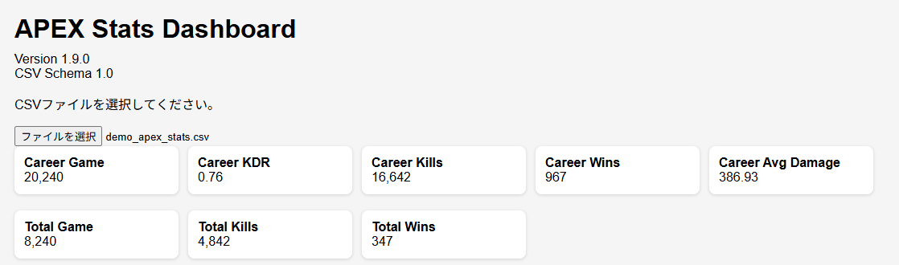
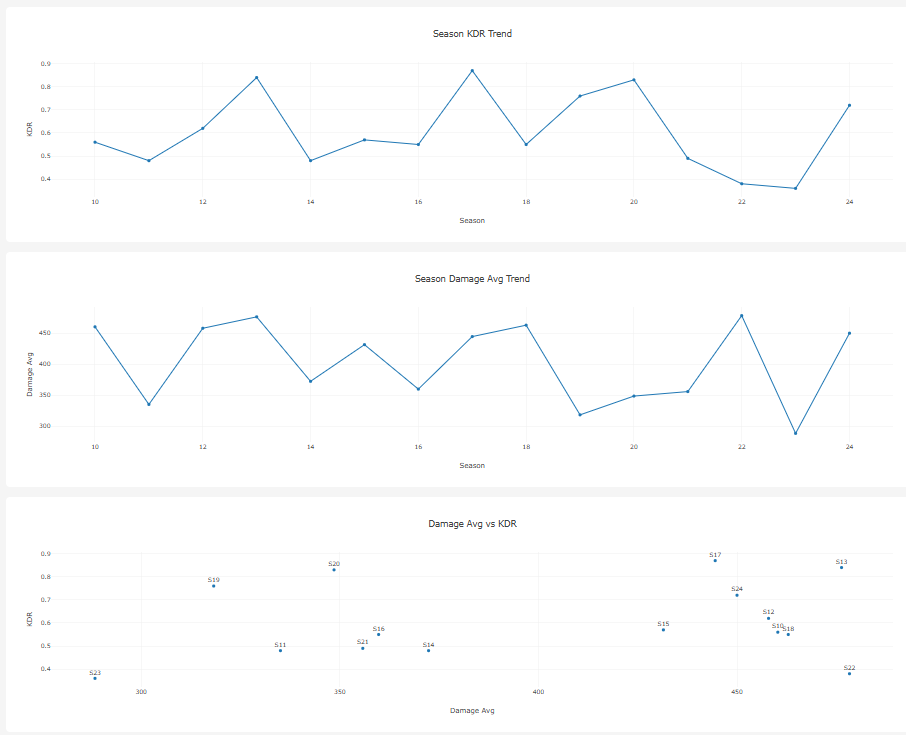

# ApexStatsOCR

Apex Legendsの「トラッカー(成績)」画面のスクリーンショットをOCR([EasyOCR](https://github.com/JaidedAI/EasyOCR))で読み取り、シーズンごとの各種スタッツをCSVへ集計。さらにHTMLダッシュボードで推移をグラフ表示するツール。

> **注記**: 本ツールはApex Legendsのファンメイドの非公式ツールであり、Electronic Arts Inc. / Respawn Entertainmentとは一切関係ありません。ゲーム画面のUIレイアウトが変更された場合、`config.json` の座標がずれてOCRが正しく機能しなくなることがあります。

## 目次

- [機能概要](#機能概要)
- [スクリーンショット](#スクリーンショット)
- [動作要件](#動作要件)
- [使い方](#使い方)
- [異常値の自動検出](#異常値の自動検出)
- [回帰テスト](#回帰テスト)
- [Contributing](#contributing)
- [ライセンス](#ライセンス)
- [変更履歴](#変更履歴)

## 機能概要

| ファイル | 役割 |
| --- | --- |
| [main.py](main.py) | OCRパイプライン本体。`input/` 内の画像を読み込み、`config.json` の座標定義に従って各項目を切り出しOCR、`output/apex_stats.csv` へ出力する |
| [config.json](config.json) | 画像の基準解像度、入出力パス、OCR設定(言語・許可文字・拡大率など)、各スタッツ項目の切り出し座標(`regions`)、異常値検出の閾値(`anomaly_detection.mad_z_threshold`)を定義。各項目の意味は[docs/config.md](docs/config.md)を参照 |
| [apex_dashboard.html](apex_dashboard.html) | 生成したCSVをブラウザで読み込み、Plotly.jsでシーズン推移(勝率・KDR・ダメージ等)をグラフ表示するダッシュボード。サーバ不要、ローカルで開くだけで動作 |
| [version.js](version.js) | `apex_dashboard.html`が表示するバージョン情報(`DASHBOARD_VERSION`/`CSV_SCHEMA_VERSION`)。ダッシュボード本体のソースにバージョンを埋め込まないよう分離している |
| `input/` | OCR対象のスクリーンショット(`シーズン番号.png`)を置くディレクトリ。**個人の成績画像のため`.gitignore`済み**(`.gitkeep`のみ管理) |
| `output/` | 生成されたCSVの出力先。**個人データのため`.gitignore`済み** |
| `debug/` | OCR時に切り出した各領域の画像が項目名ごとに保存される(`config.json`の座標調整用)。**列名ごとに1枚のみ保持され、複数画像を一括処理すると最後に処理した画像の分で上書きされるため、特定シーズンの調査には使えない**。**`.gitignore`済み** |
| `ocr.log` | 実行時のOCRログ(読み取り結果・変換後の値)。**`.gitignore`済み** |

内部の処理フロー(座標スケーリング・OCR後処理の詳細)は[docs/processing-flow.md](docs/processing-flow.md)を参照。

## スクリーンショット

`apex_dashboard.html` にCSVを読み込んだ際の表示例(サンプルデータ。個人の実データではない)。





## 動作要件

- Python 3.10以上を推奨(開発・動作確認はPython 3.14.6)
- [requirements.txt](requirements.txt) に記載の依存パッケージ(`opencv-python`, `easyocr`, `pandas`)

```bash
pip install -r requirements.txt
```

- インターネット接続が必要(`main.py` 初回実行時、EasyOCRが認識モデルをネット経由でダウンロードするため。社内プロキシ・オフライン環境では失敗する)
- 1920x1080・英語UIの成績画面を前提(`config.json` の `regions` 座標は解像度に応じてスケーリングされるが、アスペクト比やUI言語が異なると数値を正しく切り出せない場合がある)
- `input/` に画像を配置してから実行する(空のまま実行してもエラーにはならず、ヘッダーのみの空CSVが生成される。一見動いていないように見えるだけ)
- バックアップCSVは自動削除されない(実行のたびに`apex_stats_<タイムスタンプ>.csv`が`output/`に増えていくため、不要になったら手動で削除する)

## 使い方

### 1. 元画像データを準備

1. Apex Legendsを起動
2. Apex各シーズン毎の成績画面を開く
3. スクリーンショットを撮影(例:Print Screenボタン押下)
4. 取得したスクリーンショットのファイル名を`シーズン番号.png` に変更する(例:`15.png`)
5. 上記ファイルを以下へ保存: `\ApexStatsOCR\input\`
6. 2～5の作業を対象シーズン分繰り返す

### 2. CSVデータ作成

1. コマンドプロンプトを起動
2. `ApexStatsOCR` へ移動
3. `python main.py`
4. `\ApexStatsOCR\output\apex_stats.csv` にデータが作成される
5. 警告の有無を確認:`\ApexStatsOCR\ocr.log`

### 3. ダッシュボード表示

1. `apex_dashboard.html` を起動
2. 画面上部のファイル選択ボタンをクリック
3. `\ApexStatsOCR\output\apex_stats.csv` を選択
4. 各種スタッツを表示

## 異常値の自動検出

`main.py` はCSV出力後、以下の3種類のルールで異常値を自動検出し、疑わしい値があれば `ocr.log` に `WARNING` として出力する(ネットワーク通信は行わないため、EasyOCRの初回モデルダウンロード以外はオフラインで完結する)。アルゴリズムの詳細は[docs/anomaly-detection.md](docs/anomaly-detection.md)を参照。

| ルール | 対象列 | 検出内容 |
| --- | --- | --- |
| 型チェック | 全列 | OCR変換に失敗し文字列のまま残っている値 |
| 単調性チェック | `career_*`の累積カウンタ列(比率列は対象外) | シーズン順で値が前より減っている |
| 統計的外れ値検知 | `season_*`列 | 列内の他シーズンと比べて統計的に外れた値(中央値絶対偏差ベース) |

閾値は `config.json` の `anomaly_detection.mad_z_threshold` で調整できる。検出された異常値は自動修正されない。

### 修正候補の提示

統計的外れ値として検出された値については、小数点の桁ズレを想定した「修正候補」を各異常値の行に併記する(算出方法は[docs/anomaly-detection.md](docs/anomaly-detection.md)を参照)。「要目視確認」の注記はサマリ行にまとめて出力される。

```text
異常値検出: 3件の疑わしい値を検出しました(要目視確認)
  season=9 column=season_kdr value=44.0 rule=statistical_outlier detail=中央値=0.68から外れ値(修正z-score=324.70) / 修正候補: 0.44
```

修正候補はあくまで統計的な推測であり、正しさは保証されない。**CSVを自動修正することはない**ため、必ず `\ApexStatsOCR\input\シーズン番号.png` で元画像を目視確認してから手動でCSVを修正すること(`debug/<列名>.png` は最後に処理した画像の分しか残らないため、特定シーズンの確認には使えない)。妥当な候補が見つからない場合は候補なしとしてログに記録される。

## 回帰テスト

個人の成績データを含む実画像はテストに使えないため、`tests/fixtures/generate_sample.py` が
`config.json` の座標定義を使って生成した合成画像(`tests/fixtures/sample_input/1.png`、個人情報を含まない)を
サンプルとして使う。座標や後処理ロジック(`convert_value`等)を変更した際に壊れていないか確認できる。

```bash
pip install -r requirements-dev.txt
pytest tests/
```

`regions` の座標を変更した場合は、`python tests/fixtures/generate_sample.py` でサンプル画像・期待値を再生成すること。

## Contributing

個人開発のホビープロジェクトですが、バグ報告・機能要望・PRは歓迎します。GitHub Issuesへどうぞ。

### 開発環境

[回帰テスト](#回帰テスト)を参照し、`requirements-dev.txt` をインストールしてください。

### PRを送る前に

- `pytest tests/` が通ることを確認する
- `config.json` の `regions` を変更した場合は `python tests/fixtures/generate_sample.py` でサンプル画像・期待値を再生成する
- 個人の成績スクリーンショット・実データのCSVをコミットに含めない(`.gitignore`で除外済みだが念のため)

### 設計方針

- オフライン実行の特性を維持する(EasyOCRの初回モデルダウンロード以外は新規のネットワーク依存を持ち込まない)
- 異常検知等の判定ロジックは固定閾値より統計的手法を優先する

### バージョン管理

変更は `CHANGELOG.md`(Keep a Changelog形式)への追記と、SemVerに従ったgitタグ(`git tag -a vX.Y.Z`)をセットで行ってください。プロジェクトのバージョンを上げた場合は、[version.js](version.js) の `DASHBOARD_VERSION` も合わせて更新してください(`CSV_SCHEMA_VERSION` は `config.json` の `regions` の列構成が変わった時のみ更新)。

## ライセンス

[MIT License](LICENSE)

## 変更履歴

[CHANGELOG.md](CHANGELOG.md) を参照。バージョンは [Semantic Versioning](https://semver.org/) に従う。
