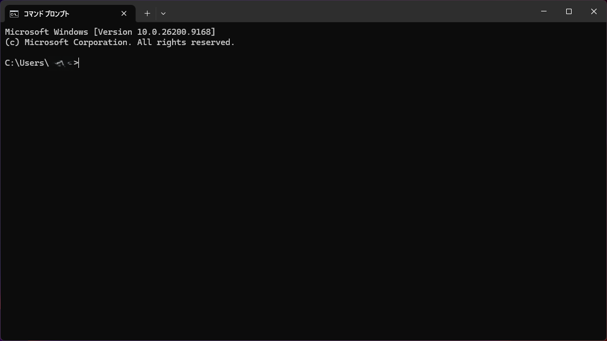
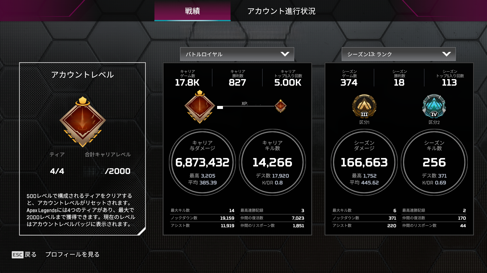

# ApexStatsOCR

Apex Legendsの「トラッカー(成績)」画面のスクリーンショットをOCR([EasyOCR](https://github.com/JaidedAI/EasyOCR))で読み取り、シーズンごとの各種スタッツをCSVへ集計。さらにHTMLダッシュボードで推移をグラフ表示するツール。

> **注記**: 本ツールはApex Legendsのファンメイドの非公式ツールであり、Electronic Arts Inc. / Respawn Entertainmentとは一切関係ありません。ゲーム画面のUIレイアウトが変更された場合、`config.json` の座標がずれてOCRが正しく機能しなくなることがあります。

## 目次

- [機能概要](#機能概要)
- [スクリーンショット](#スクリーンショット)
- [動作要件](#動作要件)
- [使い方](#使い方)
- [トラブルシューティング](#トラブルシューティング)
- [異常値の自動検出](#異常値の自動検出)
- [異常値の訂正を記録する](#異常値の訂正を記録する)
- [回帰テスト](#回帰テスト)
- [Contributing](#contributing)
- [ライセンス](#ライセンス)
- [変更履歴](#変更履歴)

## 機能概要

| ファイル | 役割 |
| --- | --- |
| [main.py](main.py) | OCRパイプライン本体。`input/` 内の画像を読み込み、`config.json` の座標定義に従って各項目を切り出しOCR、`output/apex_stats.csv` へ出力する |
| [config.json](config.json) | 画像の基準解像度、入出力パス、OCR設定(言語・許可文字・拡大率など)、各スタッツ項目の切り出し座標(`regions`)、異常値検出の閾値(`anomaly_detection.mad_z_threshold`)を定義。各項目の意味は[docs/config.md](docs/config.md)を参照 |
| [apex_dashboard.html](apex_dashboard.html) | 生成したCSVをブラウザで読み込み、Plotly.jsでシーズン推移(勝率・KDR・ダメージ等)をグラフ表示するダッシュボード。サーバ不要、ローカルで開くだけで動作 |
| `apex_dashboard_latest.html` | `main.py`が`apex_dashboard.html`にCSVデータを埋め込んで自動生成するファイル。生成後にデフォルトブラウザで自動的に開かれる。**個人データを含むため`.gitignore`済み**で、実行のたびに上書きされる(バックアップは作られない) |
| [version.js](version.js) | `apex_dashboard.html`が表示するバージョン情報(`DASHBOARD_VERSION`/`CSV_SCHEMA_VERSION`)。ダッシュボード本体のソースにバージョンを埋め込まないよう分離している |
| `input/` | OCR対象のスクリーンショット(`シーズン番号.png`)を置くディレクトリ。**個人の成績画像のため`.gitignore`済み**(`.gitkeep`のみ管理) |
| `output/` | 生成されたCSVの出力先。**個人データのため`.gitignore`済み** |
| `debug/` | OCR時に切り出した各領域の画像が項目名ごとに保存される(`config.json`の座標調整用)。**列名ごとに1枚のみ保持され、複数画像を一括処理すると最後に処理した画像の分で上書きされるため、特定シーズンの調査には使えない**。**`.gitignore`済み** |
| `ocr.log` | 実行時のOCRログ(読み取り結果・変換後の値)。**`.gitignore`済み** |
| `corrections.json` | 異常値の訂正を記録するファイル。初回実行時に無ければ自動生成される。詳細は[異常値の訂正を記録する](#異常値の訂正を記録する)を参照。**個人の統計値を含むため`.gitignore`済み** |

内部の処理フロー(座標スケーリング・OCR後処理の詳細)は[docs/processing-flow.md](docs/processing-flow.md)を参照。

## スクリーンショット

`apex_dashboard.html` にCSVを読み込んだ際の表示例(サンプルデータ。個人の実データではない)。


## 動作要件

- Python 3.10以上を推奨(開発・動作確認はPython 3.14.6)
- [requirements.txt](requirements.txt) に記載の依存パッケージ(`opencv-python`, `easyocr`, `pandas`)

```bash
pip install -r requirements.txt
```

既にPython環境を他の用途で使っている場合は、依存パッケージの衝突を避けるため仮想環境(venv)の利用を推奨します。

```bash
python -m venv venv
venv\Scripts\activate
pip install -r requirements.txt
```

- インターネット接続が必要(`main.py` 初回実行時、EasyOCRが認識モデルをネット経由でダウンロードするため。社内プロキシ・オフライン環境では失敗する)
- 1920x1080・英語UIの成績画面を前提(`config.json` の `regions` 座標は解像度に応じてスケーリングされるが、アスペクト比やUI言語が異なると数値を正しく切り出せない場合がある)
- `input/` に画像を配置してから実行する(空のまま実行してもエラーにはならず、ヘッダーのみの空CSVが生成される。一見動いていないように見えるだけ)
- バックアップCSVは自動削除されない(実行のたびに`apex_stats_<タイムスタンプ>.csv`が`output/`に増えていくため、不要になったら手動で削除する)

## 使い方

### 1. 環境を確認する

1. コマンドプロンプトを起動する
   - スタートメニューで「コマンドプロンプト」または「cmd」と検索して起動する
   - もしくは `Win + R` キーを押し、`cmd` と入力してEnter

   

2. `cd` コマンドで `ApexStatsOCR` フォルダへ移動する(保存場所が異なる場合は読み替える)

   ```bash
   cd \ApexStatsOCR
   ```

3. Pythonがインストールされているか確認する

   ```bash
   python --version
   ```

   バージョンが表示されない場合はPythonが未インストール。[Python公式サイト](https://www.python.org/downloads/)からPython 3.10以上をインストールし、インストーラの「Add python.exe to PATH」にチェックを入れる

4. 依存パッケージをインストールする

   ```bash
   pip install -r requirements.txt
   ```

   既に別の用途でPython環境を使っている場合は、依存パッケージの衝突を避けるため仮想環境(venv)の利用を推奨(詳細は[動作要件](#動作要件)を参照)

   うまくいかない場合は[トラブルシューティング](#トラブルシューティング)を参照

### 2. 元画像データを準備

1. Apex Legendsを起動
2. Apex各シーズン毎のランク成績画面を開く

   

3. スクリーンショットを撮影(例:Print Screenボタン押下)
4. 取得したスクリーンショットのファイル名を`シーズン番号.png` に変更する(例:`15.png`)
5. 上記ファイルを以下へ保存: `\ApexStatsOCR\input\`
6. 2～5の作業を対象シーズン分繰り返す

### 3. CSVデータ作成 & ダッシュボード表示

1. [手順1](#1-環境を確認する)で開いたコマンドプロンプトで(閉じてしまった場合は再度開いて`ApexStatsOCR`へ移動)、以下を実行する

   ```bash
   python main.py
   ```

2. `\ApexStatsOCR\output\apex_stats.csv` にデータが作成される
3. 作成したCSVを埋め込んだダッシュボードがデフォルトブラウザで自動的に開く(`apex_dashboard_latest.html`が生成される)
4. `\ApexStatsOCR\ocr.log` を開き、`WARNING`の行が無いか確認する

   ```text
   2026-09-08 21:00:00 WARNING 異常値検出: 3件の疑わしい値を検出しました（要目視確認）
   ```

   問題が無ければ`異常値検出: 問題ありません`とだけ記録される。`WARNING`があった場合は、該当シーズンの元画像を目視確認した上で、必要なら訂正を記録する(詳細は[異常値の自動検出](#異常値の自動検出)・[異常値の訂正を記録する](#異常値の訂正を記録する)を参照)

5. うまくいかない場合は[トラブルシューティング](#トラブルシューティング)を参照

自動オープンが不要な場合は`config.json`の`dashboard.auto_open`を`false`にする。その場合や、過去に生成した別のCSVを見たい場合は、`apex_dashboard.html`を直接起動し画面上部のファイル選択ボタンから該当のCSVを選ぶ(従来通りの手動運用)。

実行のたびに`apex_dashboard_latest.html`は上書きされ、ブラウザには新しいタブが開かれる(既存タブは自動では閉じない)。設定の詳細は[docs/config.md](docs/config.md)を参照。

## トラブルシューティング

| 症状 | 原因・対処法 |
| --- | --- |
| コマンドプロンプトで`python`が「認識されていません」と表示される | Pythonがインストールされていないか、PATHが通っていない。Pythonを再インストールし、インストーラで「Add python.exe to PATH」にチェックを入れる |
| `pip install -r requirements.txt` が失敗する | ネットワーク接続を確認する。社内プロキシ・オフライン環境の場合は接続可能な環境で実行するか、プロキシ設定を行う。それでも失敗する場合はエラーメッセージ末尾の内容を確認する |
| `python main.py` 実行時に、モデルのダウンロードに関するエラーで止まる | 初回実行時、EasyOCRが認識モデルをインターネット経由でダウンロードするために発生。オフライン・社内プロキシ環境では失敗する。インターネットに接続できる環境で一度実行し、モデルをダウンロードさせる |
| `apex_stats.csv` が作成されるが中身がヘッダーだけで空 | `input/` フォルダに画像が入っていない。[手順2](#2-元画像データを準備)に従って画像を配置してから再実行する |
| CSVの数値がおかしい・OCRが正しく読み取れていない | 成績画面の解像度が1920x1080以外、またはUI言語が英語以外の可能性がある。`config.json`の`regions`座標は解像度に応じてスケーリングされるが、アスペクト比やUI言語が異なると正しく切り出せない場合がある |
| その他、上記に当てはまらない不具合 | `\ApexStatsOCR\ocr.log` の内容を添えて[GitHub Issues](https://github.com/ninja-tanukichi/ApexStatsOCR/issues)へ報告してください |

## 異常値の自動検出

`main.py` はCSV出力後、以下の3種類のルールで異常値を自動検出し、疑わしい値があれば `ocr.log` に `WARNING` として出力する(ネットワーク通信は行わないため、EasyOCRの初回モデルダウンロード以外はオフラインで完結する)。アルゴリズムの詳細は[docs/anomaly-detection.md](docs/anomaly-detection.md)を参照。

| ルール | 対象列 | 検出内容 |
| --- | --- | --- |
| 型チェック | 全列 | OCR変換に失敗し文字列のまま残っている値 |
| 単調性チェック | `career_*`の累積カウンタ列(比率列は対象外) | シーズン順で値が前より減っている |
| 統計的外れ値検知 | `season_*`列 | 列内の他シーズンと比べて統計的に外れた値(中央値絶対偏差ベース) |

閾値は `config.json` の `anomaly_detection.mad_z_threshold` で調整できる。検出された異常値は自動修正されない(統計的な推測だけでCSVを書き換えることはしない、という意味。目視確認済みの訂正を`corrections.json`に記録すれば次回実行時から自動で反映される。詳細は[異常値の訂正を記録する](#異常値の訂正を記録する)を参照)。

### 修正候補の提示

統計的外れ値として検出された値については、小数点の桁ズレを想定した「修正候補」を各異常値の行に併記する(算出方法は[docs/anomaly-detection.md](docs/anomaly-detection.md)を参照)。「要目視確認」の注記はサマリ行にまとめて出力される。

```text
異常値検出: 3件の疑わしい値を検出しました(要目視確認)
  season=9 column=season_kdr value=44.0 rule=statistical_outlier suggested_value=0.44
```

修正候補はあくまで統計的な推測であり、正しさは保証されない。**CSVを自動修正することはない**ため、必ず `\ApexStatsOCR\input\シーズン番号.png` で元画像を目視確認した上で、正しい値を[異常値の訂正を記録する](#異常値の訂正を記録する)の手順で`corrections.json`に記録すること(`output/`配下のCSVを直接書き換えても、次回実行時のOCR結果で上書きされるため注意。`debug/<列名>.png` は最後に処理した画像の分しか残らないため、特定シーズンの確認には使えない)。妥当な候補が見つからない場合は`suggested_value=なし（要目視確認）`とログに記録される。

修正候補がどう算出されたか(中央値・修正z-scoreの計算結果)や、なぜその値になったのか(OCRの生テキスト・切り出した各項目の変換結果)を調べたい場合は、`config.json`の`log_level`を`"DEBUG"`に変更すると`ocr.log`に詳細が出力される(既定は`INFO`で、この詳細は出力されない)。

## 異常値の訂正を記録する

`input/`の画像は毎回変わらないため、目視確認して直した値を実行のたびに手動でCSVへ書き直すのは手間になる。`corrections.json`に訂正を記録しておくと、`main.py`が実行のたびに自動で適用してくれる。

### 書き方

`ocr.log`のWARNING行を見ながら、`corrections.json`(初回実行時に無ければ自動生成される空の`{}`)へ以下の形式で追記する。

```json
{
  "9": {
    "season_kdr": {"observed": 44.0, "corrected": 0.44}
  },
  "24": {
    "season_damage_avg": {"observed": 1431.4, "corrected": 143.14}
  }
}
```

- `observed`: `ocr.log`のWARNING行に出ている`value`(訂正前のOCR生値)をそのまま転記する
- `corrected`: 元画像を目視確認した上で決めた正しい値(修正候補をそのまま使う場合は`ocr.log`の`suggested_value=`の値を転記する)

### 適用の挙動

- 次回実行時、該当seasonの現在のOCR生値が`observed`と一致する場合のみ訂正を適用し、`ocr.log`にINFOで記録する
- 一致しない場合(`input/`の画像を差し替えて再OCRした等)は**訂正を適用せず、最新のOCR結果をそのまま採用**した上で`ocr.log`にWARNINGを出す。古い訂正データより新しい画像データを優先するための挙動であり、この場合は改めて元画像を確認し`corrections.json`を書き直す必要がある
- 訂正はCSV出力・異常値検出より前に適用されるため、一度正しく訂正した項目が毎回の異常値検出で再び警告されることはない

現時点では`corrections.json`の作成・更新は手動(テキストエディタでの編集)のみサポートしている。個人の統計値を含むため`.gitignore`済みで、コミットには含まれない。

## 回帰テスト

個人の成績データを含む実画像はテストに使えないため、`tests/fixtures/generate_sample.py` が
`config.json` の座標定義を使って生成した合成画像(`tests/fixtures/sample_input/1.png`、個人情報を含まない)を
サンプルとして使う。座標や後処理ロジック(`convert_value`等)を変更した際に壊れていないか確認できる。

```bash
pip install -r requirements-dev.txt
pytest tests/
```

`regions` の座標を変更した場合は、`python tests/fixtures/generate_sample.py` でサンプル画像・期待値を再生成すること。

## Contributing

個人開発のホビープロジェクトですが、バグ報告・機能要望・PRは歓迎します。GitHub Issuesへどうぞ。

### 開発環境

[回帰テスト](#回帰テスト)を参照し、`requirements-dev.txt` をインストールしてください。

### PRを送る前に

- `pytest tests/` が通ることを確認する
- `config.json` の `regions` を変更した場合は `python tests/fixtures/generate_sample.py` でサンプル画像・期待値を再生成する
- 個人の成績スクリーンショット・実データのCSV・`apex_dashboard_latest.html`(CSVデータを埋め込んだ生成物)・`corrections.json`(個人の訂正値)をコミットに含めない(`.gitignore`で除外済みだが念のため)

READMEの[スクリーンショット](#スクリーンショット)用のデモデータを更新したい場合は、`python docs/demo-data/generate_demo_stats.py` で架空データを生成できる(実データは使わないこと)。

### 設計方針

- オフライン実行の特性を維持する(EasyOCRの初回モデルダウンロード以外は新規のネットワーク依存を持ち込まない)
- 異常検知等の判定ロジックは固定閾値より統計的手法を優先する

### バージョン管理

変更は `CHANGELOG.md`(Keep a Changelog形式)への追記と、SemVerに従ったgitタグ(`git tag -a vX.Y.Z`)をセットで行ってください。プロジェクトのバージョンを上げた場合は、[version.js](version.js) の `DASHBOARD_VERSION` も合わせて更新してください(`CSV_SCHEMA_VERSION` は `config.json` の `regions` の列構成が変わった時のみ更新)。

## ライセンス

[MIT License](LICENSE)

## 変更履歴

[CHANGELOG.md](CHANGELOG.md) を参照。バージョンは [Semantic Versioning](https://semver.org/) に従う。
